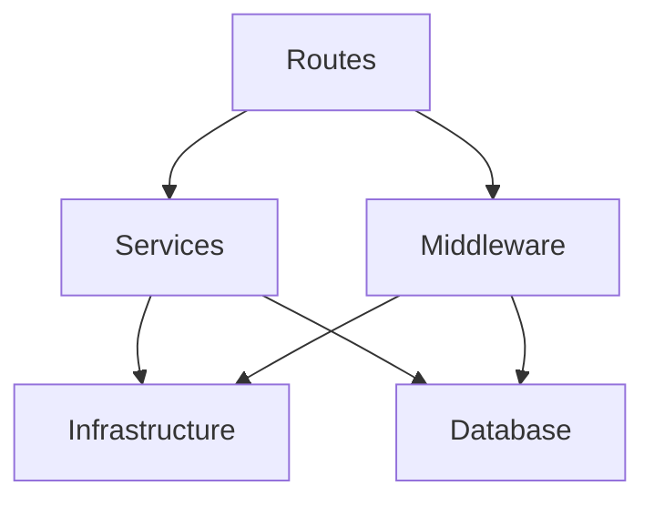

# Architecture and Structure

## システムアーキテクチャ

```
同一ネットワーク内
├── Server 1-N (管理対象サーバー)
│   ├── Agent (komolet daemon + komo-agent CLI)
│   └── OS
└── Komoriuta Server
    ├── komo-api (Backend API)
    │   └── Fastify + Connect RPC
    ├── komo-web (Frontend + Static Server)
    │   ├── React SPA
    │   └── Bun Serve
    └── Database (SQLite)
```

## 通信フロー

### Agent ⟷ API

- **Protocol**: HTTP/HTTPS + Connect (Protocol Buffers)
- **Agent → API**: ハートビート送信、マニフェスト取得
- **API → Agent**: Wake-on-LAN (Magic Packet)

### User ⟷ Web ⟷ API

- **User ⟷ Web**: HTTP/HTTPS、ブラウザ経由でアクセス
- **Web ⟷ API**: Connect RPC (Protocol Buffers)
- **Authentication**: Cookie-based session

## コンポーネント詳細

### komo-api (Backend API)

単一実行ファイル `bin/komo-api` で動作

#### レイヤードアーキテクチャ



#### ディレクトリ構成

```
src/
├── infrastructure/  # インフラストラクチャ層
│   ├── session-store.ts
│   ├── rate-limiter.ts
│   └── __tests__/
├── db/              # データベース層
│   ├── schema.ts
│   ├── migrations.ts
│   ├── transaction.ts
│   ├── migrations/
│   └── repositories/
│       ├── servers.ts
│       └── access-tokens.ts
├── services/        # ビジネスロジック層
│   ├── auth.ts
│   ├── server.ts
│   ├── heartbeat.ts
│   ├── wol.ts
│   └── __tests__/
├── routes/          # ルーティング層（Connect RPCエンドポイント）
│   └── connect.ts
├── middleware/      # ミドルウェア層
│   ├── auth.ts
│   ├── error.ts
│   ├── rate-limit.ts
│   └── __tests__/
└── shared/          # 共通定義
    ├── constants/
    ├── types/
    └── utils/       # ログ、暗号化、環境変数
```

#### 各層の責務

- **Infrastructure 層**: 技術的な処理（ISessionStore, IRateLimiter 等のインターフェースと InMemory 実装）
- **Database 層**: SQLite 接続、スキーマ定義、マイグレーション、リポジトリパターン、トランザクション管理
- **Services 層**: ビジネスロジック（認証、サーバー管理、ハートビート、WoL）、DI（依存性注入）パターン使用
- **Middleware 層**: リクエスト/レスポンスインターセプト、認証チェック、レート制限、エラーハンドリング
- **Routes 層**: Connect RPC エンドポイント定義、Protocol Buffers スキーマからの自動生成コード使用
- **Shared 層**: 共有型定義、定数、ユーティリティ（ログ、scrypt 暗号化、環境変数管理）

### komo-web (Frontend + Static Server)

単一実行ファイル `bin/komo-web` で動作（フロントエンドアセット含む）

#### ディレクトリ構成

```
src/
├── middleware/  # サーバーミドルウェア層
│   └── middleware.ts
├── utils/       # サーバーユーティリティ層
│   ├── logger.ts
│   └── env.ts
├── shared/      # 共通定義（サーバー・フロントエンド間共有）
│   ├── constants/
│   └── types/
└── frontend/    # フロントエンドアプリ
    ├── components/  # 再利用可能コンポーネント
    │   └── LoginForm.tsx
    ├── pages/       # ページコンポーネント
    │   ├── Login.tsx
    │   ├── Servers.tsx
    │   ├── ServerDetail.tsx
    │   └── ConnectTest.tsx
    ├── utils/       # フロントエンドユーティリティ
    │   ├── env.ts
    │   └── connectClient.ts
    ├── styles/      # スタイル
    │   └── index.css
    ├── App.tsx      # ルーティング
    ├── index.tsx    # エントリーポイント
    └── index.html
```

#### 各層の責務

- **サーバー層**: Bun Serve による静的ファイル配信、HMR 対応、ルーティング
- **フロントエンド層**: React ベースの SPA、ページ・コンポーネント構成、Connect RPC 通信
- **共通層**: サーバー・フロントエンド間で共有する型・定数

#### フロントエンド設計

- **プレゼンテーションコンポーネント**: UI の表示に専念、props を受け取り表示
- **コンテナコンポーネント**: データ取得、状態管理、ビジネスロジック
- **スタイリング**: Tailwind CSS（ユーティリティファースト）、将来的に shadcn/ui

### Agent

2 つのコンポーネントで構成

#### komo-agent (CLI)

設定管理と komolet 制御用 CLI ツール

- `init`: 初期設定
- `set`: 設定変更
- `enable/disable`: 有効化/無効化
- `status`: 状態確認
- `reload`: 設定再読み込み
- `help`: ヘルプ表示
- `version`: バージョン表示

#### komolet (Daemon)

systemd 等で管理されるバックグラウンドプロセス

- マニフェスト取得
- ハートビート送信
- シャットダウン実行

### 設定ファイル

- API: 環境変数
- Web: 環境変数
- Agent: `/etc/komoriuta/config.json`

## データベーススキーマ

### ユーザー管理

- データベーステーブルではなく環境変数で管理
- 1 ユーザーのみサポート（USER_ID, PASSWORD_HASH）

### servers テーブル

- サーバー情報管理
- 電源ステータス、ハートビートステータス保存
- UUID、名前、MAC アドレス等

### access_tokens テーブル

- サーバー毎のアクセストークン管理
- scrypt でハッシュ化して保存

## ステータス管理

### Power Status (電源ステータス)

API 側で規定するあるべき状態

- ON
- OFF

### Heartbeat Status (ハートビートステータス)

Agent 側から報告する現在の状態

- Launched: 起動直後
- ON: 稼働中
- Stopping: 停止処理中
- None: 報告なし（停止状態）

### Current Status (カレントステータス)

電源ステータスとハートビートステータスから算出

- ON, OFF
- Starting, Stopping
- Applying
- SyncedON, SyncedOFF
- Lost, Warning, Error

詳細な状態遷移は `/docs/srs.md` を参照

## ログ出力

### ファイル配置

- `/var/log/komoriuta/komo-api.log.jsonl`
- `/var/log/komoriuta/komo-web.log.jsonl`
- `/var/log/komoriuta/komo-agent.log.jsonl`
- `/var/log/komoriuta/komolet.log.jsonl`

### ローテーション

- logrotate を使用
- 1 日ごと、7 世代保持（環境変数で変更可能）
- パーミッション: 600

## セキュリティ層

### 認証・認可

- ユーザー: ID/パスワード + セッション Cookie
- Agent: Bearer Token

### 通信

- localhost 以外: HTTPS 強制
- CORS 設定: 同一オリジンのみ
- CSRF 対策: SameSite=Strict

### データ保護

- パスワード: scrypt ハッシュ化
- アクセストークン: scrypt ハッシュ化
- ログ: 機密情報マスク
