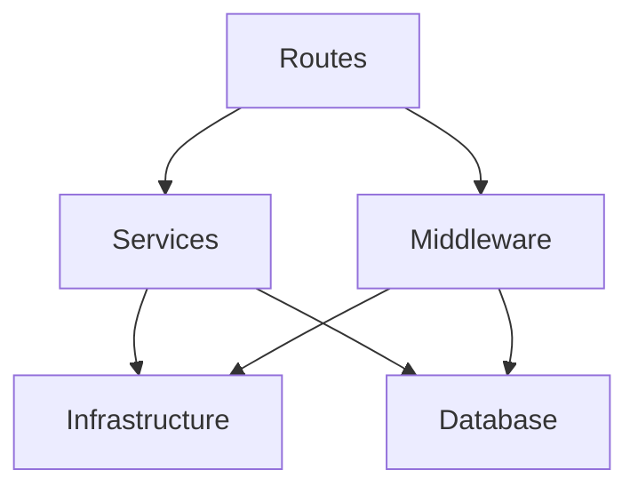

# komo-api アーキテクチャ設計

このドキュメントでは、komo-api パッケージ固有のディレクトリ構成と拡張ポイントについて説明します。

システム全体のアーキテクチャについては、[プロジェクトドキュメント](/docs)を参照してください。

## ディレクトリ構成

```
src/
├── infrastructure/  # インフラストラクチャ層
├── db/              # データベース層
├── services/        # ビジネスロジック層
├── routes/          # ルーティング層（Connect RPCエンドポイント）
├── middleware/      # ミドルウェア層
├── utils/           # ユーティリティ層
├── types/           # 型定義
└── shared/          # 共通定義
```

## 各層の責務

### レイヤードアーキテクチャ

本プロジェクトは以下の依存関係を持つレイヤードアーキテクチャを採用しています。



### 各層の詳細

- **インフラストラクチャ層** (`src/infrastructure/`)
  - 技術的な処理を行うための層
    - 例: `ISessionStore`, `IRateLimiter`とそれぞれの InMemory 実装
  - インターフェース定義と実装を提供
- **データベース層** (`src/db/`)
  - SQLite 接続、スキーマ定義、マイグレーション
  - リポジトリパターンによるデータアクセス抽象化
  - トランザクション管理
- **サービス層** (`src/services/`)
  - 純粋なビジネスロジック（認証、サーバー管理、ハートビート、Wake-on-LAN）
  - 依存性注入（DI）パターンを使用
  - インフラストラクチャ層のインターフェースに依存
  - ミドルウェア層には依存しない
- **ミドルウェア層** (`src/middleware/`)
  - リクエスト/レスポンスのインターセプト処理
  - 認証チェック（セッション、エージェント）
  - レート制限（薄いラッパー、実装は Infrastructure 層）
  - エラーハンドリング
- **ルーティング層** (`src/routes/`)
  - Connect RPC エンドポイント定義
  - Protocol Buffers スキーマからの自動生成コードを使用
  - RESTful API は使用しない
- **ユーティリティ層** (`src/utils/`)
  - ログ、暗号化（scrypt）、環境変数管理
  - 各層から利用可能
- **共通層** (`src/shared/`)
  - 共有型定義・定数

データフローやセキュリティ設計の詳細については、[プロジェクトドキュメント](/docs)を参照してください。

## 拡張方法

### 新しい API エンドポイントの追加

1. `proto/` で Protocol Buffers スキーマを定義
2. `buf generate` でクライアント/サーバーコードを生成
3. `services/` にビジネスロジックを実装（DI を使用）
4. `routes/connect.ts` に新しいエンドポイントを追加
5. 必要に応じて `middleware/` で認証・レート制限を適用

### 新しいサービスの追加

1. 必要に応じて `infrastructure/` にインターフェースと実装を作成
2. `services/` に新しいサービスファイルを作成（DI パターンを使用）
3. `routes/connect.ts` で Connect RPC エンドポイントを公開
4. `db/schema.ts` でテーブル定義を追加（必要に応じて）
5. `db/migrations/` でマイグレーションを追加

### 新しい Infrastructure 実装の追加

1. `infrastructure/` にインターフェースを定義
2. InMemory 実装を作成（開発・テスト用）
3. 必要に応じて永続化実装を追加（Redis 等）
4. `__tests__/` ディレクトリにユニットテストを作成
5. サービス層で DI パターンで利用

## テスト戦略

### ディレクトリ構造

各層のソースコードと同じディレクトリに `__tests__/` を配置し、テストファイルは `.test.ts` サフィックスを使用します。

### テストランナー

- Bun の組み込みテストランナーを使用
- コマンド: `bun test`

### モックと DI

- サービス層のテストでは、Infrastructure 層のインターフェースをモック実装
- ミドルウェア層のテストでは、ファクトリ関数を使用して DI

## 今後の課題

- ✅ データベースマイグレーション機能の追加
- ✅ Infrastructure 層の抽象化と DI パターンの導入
- ✅ 認証 API のユニットテスト
- ハートビート監視の起動処理追加
- エラーハンドリングの強化
- 統合テスト・E2E テストの追加
- ヘルスチェックエンドポイントの追加
- Docker/Podman コンテナ化

## 関連ドキュメント

- [PRD](/docs/prd.md): プロダクト要求定義
- [SRS](/docs/srs.md): ソフトウェア要件定義
- [SDD](/docs/sdd.md): システム設計ドキュメント
- [パッケージ README](./README.md): 開発者向けドキュメント
